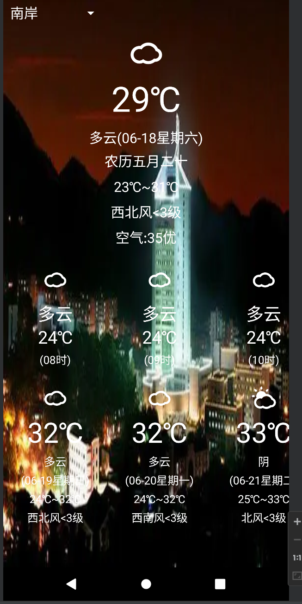

# 我的天气说明文档  

------

## 主界面

（现实是外面已经下雨了，然而这个天气预报不准，南山的天气有点离谱）

## 1、时间

oncreate：2022年6月  

耗时两周左右

## 2、参考

视频：[b站 子林android]([28.1-实战演练-做一个简单的记事本App(1)_哔哩哔哩_bilibili](https://www.bilibili.com/video/BV1C54y137Dh/?spm_id_from=333.788.recommend_more_video.1))

源文件复制下来再改的

## 3、增加

1、更改spinner 内容 同时根据触发的内容修改主界面背景（虽然好丑好丑）

2、增加农历（主要是因为希望一打开能看见农历，在推算下月亮阴晴圆缺方便）

3、增加24小时天气状况（这个很有用）

### 4、未完成功能

1、希望spinner改进，增加一个事件监听（其他城市），触发后弹出输入文本框

2、更进一步，常用城市的增删改查

3、24小时天气加上“今天”、“明天”

4、消息栏通知下雨

5、界面美化 真的好丑

